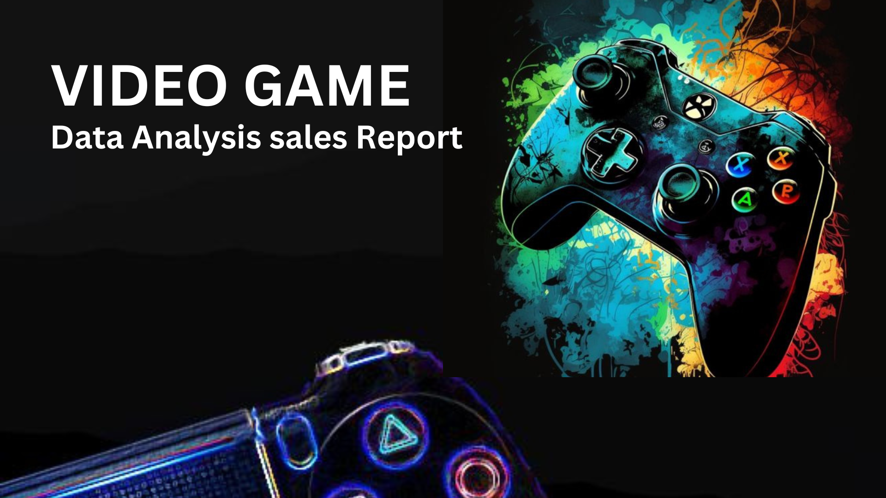
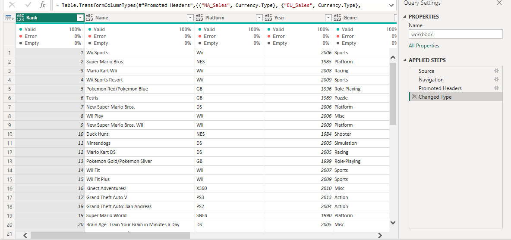
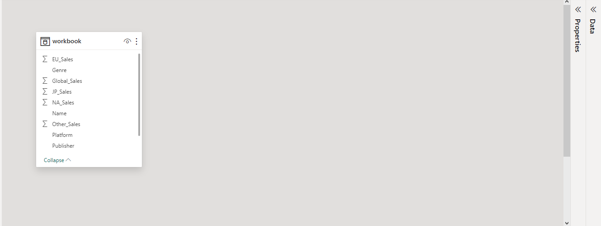
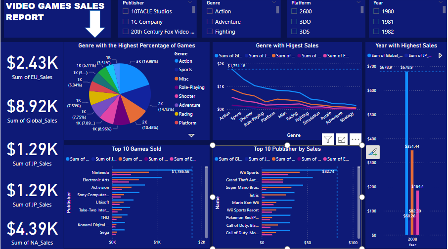

# Video-Games-Data-Analysis-Sales-Report

## Introduction:
In Bali, the sales store possesses a dataset featuring video games with sales exceeding 100,000 copies. These products are categorized based on various fields and sold across different mediums, resulting to the following sales section: Global sales, JP Sales, NA sales, EU sales, and other sales.

## Problem Statement:
As a Data Analyst, I have been tasked to analyze the video games sales dataset at the sales store, leveraging data cleaning and visualization skills. Provide insights on the following:
1. Genre with the highest percentage of games
2. Genre with the highest sales
3. Top 10 publishers by sales
4. Top 10 games sold
5. Identify the year with the highest sales and suggest the reasons behind it.

## Data Sourcing:
Link to Dataset: [here]  vgsales - Google Sheets

## Skills Demonstrated:
Given the insights we aim to uncover, DAX measures are unnecessary. Power BI automatically facilitates basic calculations when appropriately placed in the relevant fields. But still page navigation, filters and Bookmarking were incorporated.

## Data Transformation:
The data set was cleansed in excel server using delimiters, Trim and Replace function. However, I imported the dataset into Power Bi tool using power query Changed Header type E.g Text and Decimal numbers.

## Modelling:
The dataset was structured as a table, eliminating the need for external data connections.

## Visualization and Analysis:
The dashboard was crafted utilizing slicers, cards, line charts, pie charts, and column charts to enhance the visualization and analysis of the data.

The insights drawn from this report indicate that the Action genre comprises the highest percentage of games at approximately 19.98%, and it also leads in sales among other genres. The top 10 games sold are from publishers including Nintendo, Electronic Arts, Activision, Sony Computer Entertainment, Ubisoft, Take-Two Interactive, THQ, Konami Digital Entertainment, Sega, and Namco Bandai Games.

The highest-selling games include Wii Sports, Grand Theft Auto V, Super Mario Bros, Tetris, Mario Kart Wii, Wii Sports Resort, Pokemon Red/Pokemon Blue, Call of Duty: Black Ops, Call of Duty: Modern Warfare 3, and New Super Mario Bros. The top 10 publishers by sales encompass Wii Sports, Grand Theft Auto V, Super Mario Bros, Tetris, Mario Kart Wii, Wii Sports Resort, Pokemon Red/Pokemon Blue, Call of Duty: Black Ops, Call of Duty: Modern Warfare 3, and New Super Mario Bros. 

In 2008, the maximum sales were achieved, reaching $678.9 million in Global sales, $351.44 million in NA sales, $60.28 million in JP sales, $82.29 million in other sales, and $184.4 million in EU sales.

## Recommendation
In conclusion, the report underscores the dominance of the Action genre in both game prevalence and sales. The top 10 publishers and games contributing to sales have been identified. The year 2008 marked the peak in sales across different platforms. As a recommendation, further analysis and monitoring of genre trends and publisher performance could provide valuable insights for the gaming industry.
Additionally, technological advancements, and evolving consumer behaviors will help the industry adapt and innovate. Considering the dynamic nature of the gaming market, collaboration and partnerships between publishers, developers, and platform providers may enhance the creation and distribution of successful titles. Exploring new markets and demographics, as well as leveraging emerging platforms and technologies, could open up untapped opportunities for growth.
